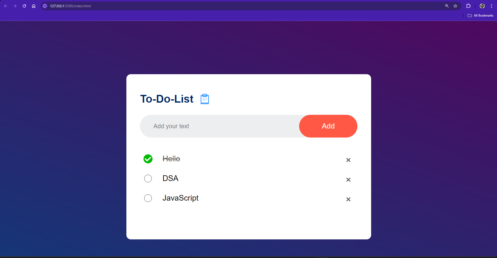
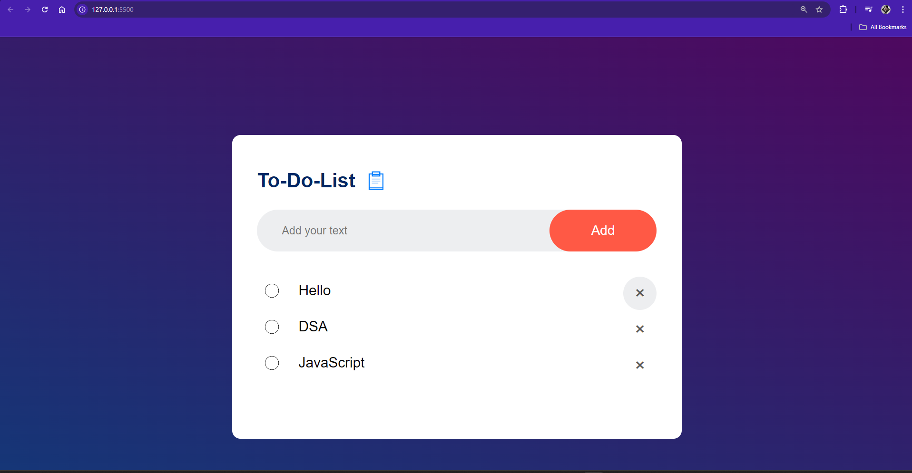

# 📝 To Do List App
A sleek and minimal To-Do List application that helps you stay organized. Built with HTML, CSS, and JavaScript, this app enables users to add, mark as completed, and delete tasks. It also saves your tasks using localStorage so that your list persists even after the page is refreshed.

## 🌟 Features
Add Task: Input a task and add it to the list.
Mark as Completed: Toggle tasks as completed with a click.
Delete Task: Remove tasks individually with a delete button.
Persistent Data: Tasks are saved in localStorage, so your list is maintained even after a browser refresh.

Here are some screenshots showcasing the To-Do List app in action:
## 📷 🎨 Preview
1. **Initial Screen** 
   

2. **Task Added** 
   

3. **Task Marked as Completed**
   

Follow these steps to set up the project locally.

1. **Clone the Repository**
bash
Copy code
git clone https://github.com/yourusername/todo-list-app.git

2. **Open the Project**
Navigate to the project folder and open the index.html file in your browser:

bash
Copy code
cd todo-list-app
open index.html
🛠️ Technologies Used
HTML5: Structure of the app
CSS3: Styling and layout
JavaScript (ES6): Functionality for adding, removing, and saving tasks
localStorage: Data persistence across sessions

## 📁 Project Structure
graphql
Copy code
├── index.html     # The main HTML file
├── style.css      # Stylesheet for the To-Do List app
├── script.js      # JavaScript functionality for the app
└── images/        # Folder for image assets (icons, screenshots)

## 📖 How It Works
1. **Adding Tasks**
Enter your task in the input field and click the "Add" button. This will create a new task in the list.
2. **Marking Tasks as Completed**
Click on a task to toggle its completion status. Completed tasks are crossed out.
3. **Deleting Tasks**
Each task has a delete button (×). Click the button to remove the task from the list.
4. **Data Persistence**
The app uses the browser’s localStorage to save tasks. Even if you refresh or close the browser, your tasks will still be there when you reopen the app.

## 🎯 Future Enhancements
Some ideas to enhance this app in the future:

**Task Editing:** Allow users to edit tasks after they've been added.
**Filters:** Add a filter option to display "All", "Completed", and "Pending" tasks.
**Dark Mode:** Implement a dark theme for better usability at night.
**Responsive Design:** Improve the layout for mobile and tablet devices.

Welcome to the **Drag and Drop Tier List App**! This application allows users to create custom tier lists by easily dragging and dropping items into designated categories.

## Features

- **User-Friendly Interface**: Intuitive drag-and-drop functionality.
- **Customizable Tiers**: Create and rename tiers to fit your needs.
- **Save and Share Options**: Save your tier lists and share them with others.

### Prerequisites

- A modern web browser (Chrome, Firefox, Safari, etc.)

